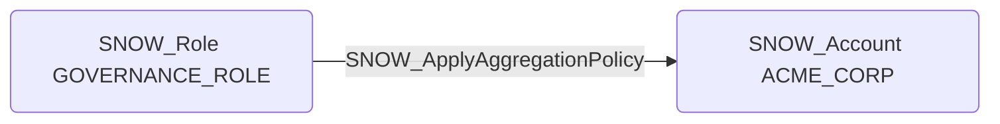

# SNOW_ApplyAggregationPolicy

## Edge Schema

- Source: [SNOW_Role](../NodeDescriptions/SNOW_Role.md), [SNOW_ApplicationRole](../NodeDescriptions/SNOW_ApplicationRole.md)
- Destination: [SNOW_Account](../NodeDescriptions/SNOW_Account.md), [SNOW_Table](../NodeDescriptions/SNOW_Table.md)

## General Information

The non-traversable `SNOW_ApplyAggregationPolicy` edge represents the APPLY AGGREGATION POLICY privilege in Snowflake, which grants the ability to apply aggregation policies that restrict query results to aggregate values only. An attacker could remove aggregation policies to access raw, row-level data that was previously restricted to aggregate-only queries, or apply overly restrictive policies to cause denial of service by preventing legitimate analytical queries. This privilege is particularly significant in environments where aggregation policies enforce privacy requirements such as k-anonymity or differential privacy controls.

