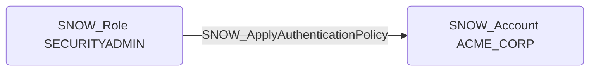

# SNOW_ApplyAuthenticationPolicy

## Edge Schema

- Source: [SNOW_Role](../NodeDescriptions/SNOW_Role.md), [SNOW_ApplicationRole](../NodeDescriptions/SNOW_ApplicationRole.md)
- Destination: [SNOW_Account](../NodeDescriptions/SNOW_Account.md)

## General Information

The non-traversable `SNOW_ApplyAuthenticationPolicy` edge represents the APPLY AUTHENTICATION POLICY privilege in Snowflake, which grants the ability to apply authentication policies that control how users authenticate to the account. A malicious actor could weaken authentication requirements by disabling MFA enforcement, allowing password-only authentication, or broadening the set of permitted authentication methods to facilitate unauthorized access. This is a high-impact security control -- weakening authentication policies at the account level affects all users and could enable credential-based attacks that would otherwise be blocked.

