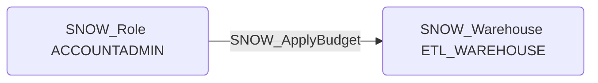

# SNOW_ApplyBudget

## Edge Schema

- Source: [SNOW_Role](../NodeDescriptions/SNOW_Role.md), [SNOW_ApplicationRole](../NodeDescriptions/SNOW_ApplicationRole.md)
- Destination: [SNOW_Account](../NodeDescriptions/SNOW_Account.md), [SNOW_Warehouse](../NodeDescriptions/SNOW_Warehouse.md)

## General Information

The non-traversable `SNOW_ApplyBudget` edge represents the APPLY BUDGET privilege in Snowflake, which grants the ability to apply budget controls to warehouses and the account. While primarily a financial governance control, budget manipulation could cause denial of service by setting restrictive budgets that halt compute operations when limits are reached. An attacker could also remove budget controls to allow unchecked resource consumption, leading to significant financial impact, or set artificially low budgets to disrupt critical data pipelines and warehouse operations.

