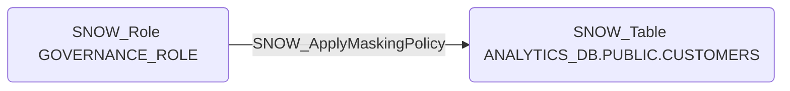

# SNOW_ApplyMaskingPolicy

## Edge Schema

- Source: [SNOW_Role](../NodeDescriptions/SNOW_Role.md), [SNOW_ApplicationRole](../NodeDescriptions/SNOW_ApplicationRole.md)
- Destination: [SNOW_Account](../NodeDescriptions/SNOW_Account.md), [SNOW_Table](../NodeDescriptions/SNOW_Table.md), [SNOW_View](../NodeDescriptions/SNOW_View.md)

## General Information

The non-traversable `SNOW_ApplyMaskingPolicy` edge represents the APPLY MASKING POLICY privilege in Snowflake, which grants the ability to apply or remove data masking policies on tables and views. Removing masking policies would expose sensitive data such as PII, financial records, or healthcare information that was previously masked from unauthorized roles. This is critical for data protection compliance -- an attacker who removes masking policies could access full Social Security numbers, credit card numbers, or other regulated data that should only be visible in masked form.

