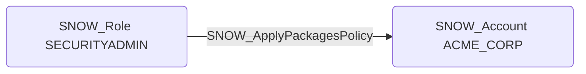

# SNOW_ApplyPackagesPolicy

## Edge Schema

- Source: [SNOW_Role](../NodeDescriptions/SNOW_Role.md), [SNOW_ApplicationRole](../NodeDescriptions/SNOW_ApplicationRole.md)
- Destination: [SNOW_Account](../NodeDescriptions/SNOW_Account.md)

## General Information

The non-traversable `SNOW_ApplyPackagesPolicy` edge represents the APPLY PACKAGES POLICY privilege in Snowflake, which grants the ability to apply packages policies that control which Python and Java packages can be used in UDFs and stored procedures. Weakening packages policies could allow the installation of malicious or vulnerable third-party packages within Snowflake functions, enabling code execution attacks. An attacker with this privilege could broaden the allowlist to include packages with known vulnerabilities or packages that facilitate data exfiltration, network communication, or other malicious operations from within the Snowflake compute environment.

