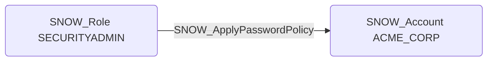

# SNOW_ApplyPasswordPolicy

## Edge Schema

- Source: [SNOW_Role](../NodeDescriptions/SNOW_Role.md), [SNOW_ApplicationRole](../NodeDescriptions/SNOW_ApplicationRole.md)
- Destination: [SNOW_Account](../NodeDescriptions/SNOW_Account.md)

## General Information

The non-traversable `SNOW_ApplyPasswordPolicy` edge represents the APPLY PASSWORD POLICY privilege in Snowflake, which grants the ability to apply password policies controlling password complexity, rotation requirements, and account lockout behavior. Weakening password policies facilitates brute-force attacks and credential compromise by reducing minimum complexity requirements, extending or eliminating rotation periods, or increasing the number of failed login attempts before lockout. This privilege directly impacts the security posture of all password-authenticated users in the account and should be closely monitored for unauthorized changes.

