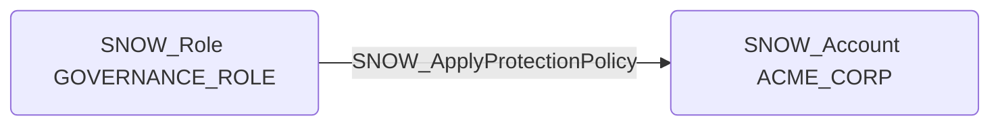

# SNOW_ApplyProtectionPolicy

## Edge Schema

- Source: [SNOW_Role](../NodeDescriptions/SNOW_Role.md), [SNOW_ApplicationRole](../NodeDescriptions/SNOW_ApplicationRole.md)
- Destination: [SNOW_Account](../NodeDescriptions/SNOW_Account.md)

## General Information

The non-traversable `SNOW_ApplyProtectionPolicy` edge represents the APPLY PROTECTION POLICY privilege in Snowflake, which grants the ability to apply protection policies for data governance at the account level. Protection policies control data access at a fine-grained level, and modifying or removing them could expose protected data that was previously restricted. An attacker with this privilege could weaken or remove protection policies to bypass data governance controls, potentially accessing sensitive datasets that are subject to regulatory or compliance requirements.

