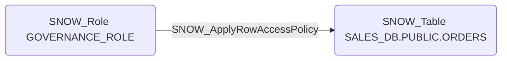

# SNOW_ApplyRowAccessPolicy

## Edge Schema

- Source: [SNOW_Role](../NodeDescriptions/SNOW_Role.md), [SNOW_ApplicationRole](../NodeDescriptions/SNOW_ApplicationRole.md)
- Destination: [SNOW_Account](../NodeDescriptions/SNOW_Account.md), [SNOW_Table](../NodeDescriptions/SNOW_Table.md), [SNOW_View](../NodeDescriptions/SNOW_View.md)

## General Information

The non-traversable `SNOW_ApplyRowAccessPolicy` edge represents the APPLY ROW ACCESS POLICY privilege in Snowflake, which grants the ability to apply row access policies that filter which rows users can see in tables and views. Removing row access policies would expose all rows in a table, potentially revealing data that should be restricted by tenant, region, classification level, or other segmentation criteria. This is a critical data security control -- row access policies are commonly used for multi-tenant data isolation, and their removal could lead to cross-tenant data exposure or violation of data residency requirements.

