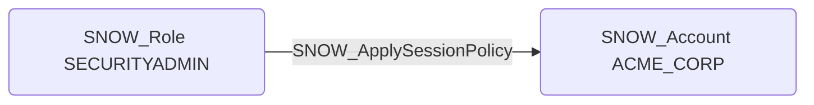

# SNOW_ApplySessionPolicy

## Edge Schema

- Source: [SNOW_Role](../NodeDescriptions/SNOW_Role.md), [SNOW_ApplicationRole](../NodeDescriptions/SNOW_ApplicationRole.md)
- Destination: [SNOW_Account](../NodeDescriptions/SNOW_Account.md)

## General Information

The non-traversable `SNOW_ApplySessionPolicy` edge represents the APPLY SESSION POLICY privilege in Snowflake, which grants the ability to apply session policies controlling session timeout and idle disconnect behavior at the account level. Weakening session policies by extending timeouts or disabling idle disconnect increases the window for session hijacking and unauthorized access through abandoned sessions. An attacker could modify session policies to allow sessions to persist indefinitely, making it easier to reuse stolen session tokens or maintain persistent access through long-lived sessions that would otherwise be terminated.

