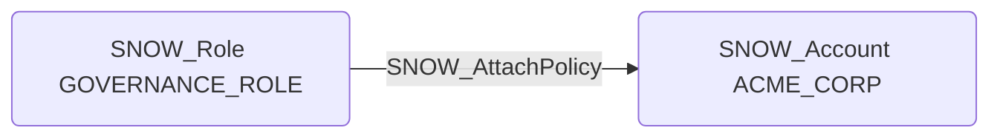

# SNOW_AttachPolicy

## Edge Schema

- Source: [SNOW_Role](../NodeDescriptions/SNOW_Role.md), [SNOW_ApplicationRole](../NodeDescriptions/SNOW_ApplicationRole.md)
- Destination: [SNOW_Account](../NodeDescriptions/SNOW_Account.md)

## General Information

The non-traversable `SNOW_AttachPolicy` edge represents the ATTACH POLICY privilege in Snowflake, which grants the ability to attach policies to objects across the account. This is a general policy management capability that could be used to modify security controls by attaching new policies or replacing existing ones on any object. An attacker with this privilege could attach permissive policies that override restrictive ones, or attach policies designed to leak data through policy evaluation side effects, making this a broad-scope privilege that affects the security posture of the entire account.

