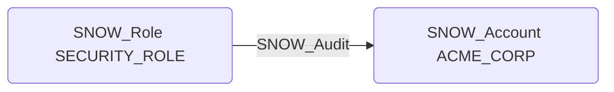

# SNOW_Audit

## Edge Schema

- Source: [SNOW_Role](../NodeDescriptions/SNOW_Role.md), [SNOW_ApplicationRole](../NodeDescriptions/SNOW_ApplicationRole.md)
- Destination: [SNOW_Account](../NodeDescriptions/SNOW_Account.md)

## General Information

The non-traversable `SNOW_Audit` edge grants the ability to audit operations on the account. While primarily a monitoring capability, audit access reveals detailed information about all account activities and configurations. An attacker with audit access could enumerate all users, roles, and privilege grants to map out the complete security posture, identify weak points, and plan targeted privilege escalation attacks.

