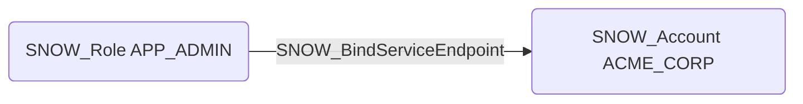

# SNOW_BindServiceEndpoint

## Edge Schema

- Source: [SNOW_Role](../NodeDescriptions/SNOW_Role.md), [SNOW_ApplicationRole](../NodeDescriptions/SNOW_ApplicationRole.md)
- Destination: [SNOW_Account](../NodeDescriptions/SNOW_Account.md)

## General Information

The non-traversable `SNOW_BindServiceEndpoint` edge represents the BIND SERVICE ENDPOINT privilege in Snowflake, which grants the ability to bind service endpoints for Snowpark Container Services. Binding endpoints could expose internal services externally or create unauthorized network paths between containers and external systems. An attacker with this privilege could bind endpoints that allow inbound access to containerized services running within Snowflake, potentially establishing a reverse shell, exfiltrating data through container network egress, or creating persistent access points that bypass traditional Snowflake access controls.

