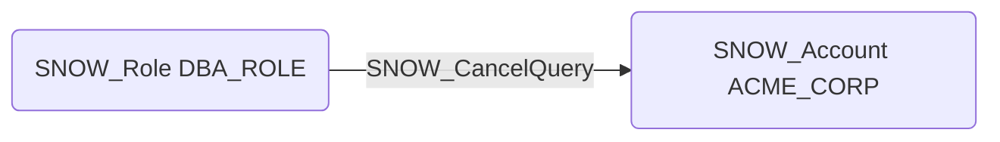

# SNOW_CancelQuery

## Edge Schema

- Source: [SNOW_Role](../NodeDescriptions/SNOW_Role.md), [SNOW_ApplicationRole](../NodeDescriptions/SNOW_ApplicationRole.md)
- Destination: [SNOW_Account](../NodeDescriptions/SNOW_Account.md)

## General Information

The non-traversable `SNOW_CancelQuery` edge represents the CANCEL QUERY privilege in Snowflake, which grants the ability to cancel any running query in the account. This could be used for denial of service by canceling critical ETL pipelines, analytics workloads, or data transformation jobs. An attacker with this privilege could disrupt business operations by systematically canceling long-running queries, preventing data loads from completing, or interfering with time-sensitive reporting processes.

