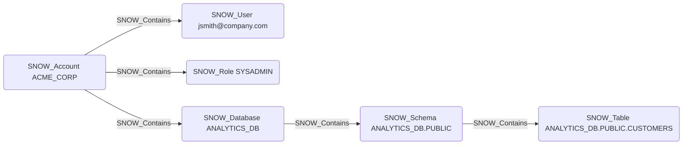

# SNOW_Contains

## Edge Schema

- Source: [SNOW_Account](../NodeDescriptions/SNOW_Account.md), [SNOW_Application](../NodeDescriptions/SNOW_Application.md), [SNOW_Database](../NodeDescriptions/SNOW_Database.md), [SNOW_Schema](../NodeDescriptions/SNOW_Schema.md)
- Destination: [SNOW_User](../NodeDescriptions/SNOW_User.md), [SNOW_Role](../NodeDescriptions/SNOW_Role.md), [SNOW_Application](../NodeDescriptions/SNOW_Application.md), [SNOW_ApplicationRole](../NodeDescriptions/SNOW_ApplicationRole.md), [SNOW_Warehouse](../NodeDescriptions/SNOW_Warehouse.md), [SNOW_Database](../NodeDescriptions/SNOW_Database.md), [SNOW_Schema](../NodeDescriptions/SNOW_Schema.md), [SNOW_Stage](../NodeDescriptions/SNOW_Stage.md), [SNOW_Table](../NodeDescriptions/SNOW_Table.md), [SNOW_View](../NodeDescriptions/SNOW_View.md), [SNOW_Integration](../NodeDescriptions/SNOW_Integration.md), [SNOW_Function](../NodeDescriptions/SNOW_Function.md), [SNOW_Procedure](../NodeDescriptions/SNOW_Procedure.md)

## General Information

The non-traversable `SNOW_Contains` edge represents structural containment hierarchy in Snowflake. SNOW_Account contains all account-level objects such as users, roles, databases, and warehouses. SNOW_Database contains SNOW_Schema objects, and SNOW_Schema contains tables, views, stages, functions, and procedures. SNOW_Application contains SNOW_ApplicationRole objects. This is a non-traversable structural edge that models the Snowflake object hierarchy and does not represent a privilege or security relationship.

