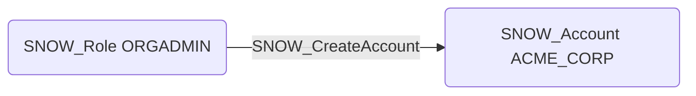

# SNOW_CreateAccount

## Edge Schema

- Source: [SNOW_Role](../NodeDescriptions/SNOW_Role.md), [SNOW_ApplicationRole](../NodeDescriptions/SNOW_ApplicationRole.md)
- Destination: [SNOW_Account](../NodeDescriptions/SNOW_Account.md)

## General Information

The non-traversable `SNOW_CreateAccount` edge represents that the source role has been granted the privilege to create new Snowflake accounts within the organization. This is an extremely powerful privilege that allows the creation of entirely new account environments, each with its own independent set of users, roles, databases, and warehouses. Only relevant for organization-level administration, this privilege should be tightly restricted as it could allow an attacker to spin up isolated accounts for staging data exfiltration or establishing persistent footholds outside the scope of existing monitoring.

