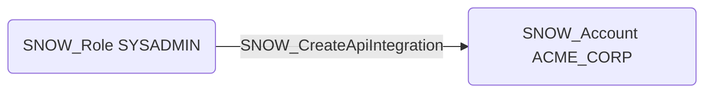

# SNOW_CreateApiIntegration

## Edge Schema

- Source: [SNOW_Role](../NodeDescriptions/SNOW_Role.md), [SNOW_ApplicationRole](../NodeDescriptions/SNOW_ApplicationRole.md)
- Destination: [SNOW_Account](../NodeDescriptions/SNOW_Account.md)

## General Information

The non-traversable `SNOW_CreateApiIntegration` edge represents that the source role has been granted the privilege to create API integrations that connect Snowflake to external REST APIs. API integrations define trusted endpoints and authentication mechanisms for external function calls, enabling Snowflake to communicate with services outside the platform. This privilege could allow an attacker to establish unauthorized external communication channels, potentially enabling data exfiltration through outbound API calls or command-and-control communication via external endpoints.

