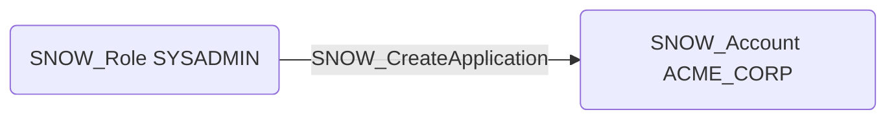

# SNOW_CreateApplication

## Edge Schema

- Source: [SNOW_Role](../NodeDescriptions/SNOW_Role.md), [SNOW_ApplicationRole](../NodeDescriptions/SNOW_ApplicationRole.md)
- Destination: [SNOW_Account](../NodeDescriptions/SNOW_Account.md)

## General Information

The non-traversable `SNOW_CreateApplication` edge represents that the source role has been granted the privilege to create Snowflake Native Apps within the account. Native Apps can execute stored procedures, user-defined functions, and Streamlit applications, making this a potential code execution vector. An attacker with this privilege could deploy a malicious application that runs arbitrary code within the account context, accesses data through the application's granted privileges, or establishes persistent backdoors disguised as legitimate applications.

