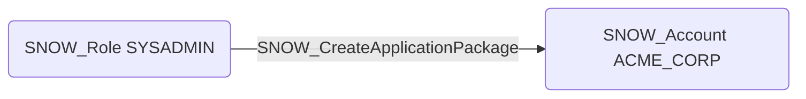

# SNOW_CreateApplicationPackage

## Edge Schema

- Source: [SNOW_Role](../NodeDescriptions/SNOW_Role.md), [SNOW_ApplicationRole](../NodeDescriptions/SNOW_ApplicationRole.md)
- Destination: [SNOW_Account](../NodeDescriptions/SNOW_Account.md)

## General Information

The non-traversable `SNOW_CreateApplicationPackage` edge represents that the source role has been granted the privilege to create application packages for distribution via the Snowflake Marketplace or direct sharing. Application packages bundle code, data, and configuration that can be installed as Native Apps in other accounts. This privilege could be used to distribute malicious applications to other Snowflake accounts, potentially enabling supply chain attacks or cross-account compromise through trojanized application packages.

