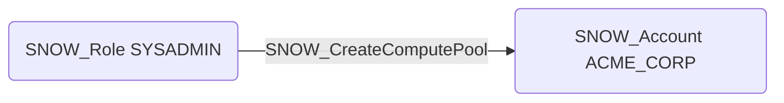

# SNOW_CreateComputePool

## Edge Schema

- Source: [SNOW_Role](../NodeDescriptions/SNOW_Role.md), [SNOW_ApplicationRole](../NodeDescriptions/SNOW_ApplicationRole.md)
- Destination: [SNOW_Account](../NodeDescriptions/SNOW_Account.md)

## General Information

The non-traversable `SNOW_CreateComputePool` edge represents that the source role has been granted the privilege to create compute pools for Snowpark Container Services. Compute pools provision dedicated compute resources that run containerized workloads, operating independently from traditional virtual warehouses. This privilege could incur significant costs through resource consumption or be used to run unauthorized compute workloads such as cryptocurrency mining, data processing pipelines for exfiltration, or hosting malicious services within the Snowflake environment.

