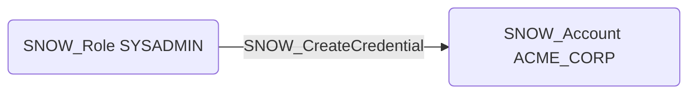

# SNOW_CreateCredential

## Edge Schema

- Source: [SNOW_Role](../NodeDescriptions/SNOW_Role.md), [SNOW_ApplicationRole](../NodeDescriptions/SNOW_ApplicationRole.md)
- Destination: [SNOW_Account](../NodeDescriptions/SNOW_Account.md)

## General Information

The non-traversable `SNOW_CreateCredential` edge represents that the source role has been granted the privilege to create credential objects that store authentication information for connecting to external services. Credential objects can contain usernames, passwords, OAuth tokens, and other secrets used by integrations and external functions. This privilege could be used to establish persistent access mechanisms by storing attacker-controlled credentials, or to configure connections to malicious external endpoints that capture sensitive data during authentication flows.

