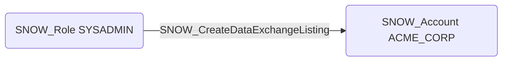

# SNOW_CreateDataExchangeListing

## Edge Schema

- Source: [SNOW_Role](../NodeDescriptions/SNOW_Role.md), [SNOW_ApplicationRole](../NodeDescriptions/SNOW_ApplicationRole.md)
- Destination: [SNOW_Account](../NodeDescriptions/SNOW_Account.md)

## General Information

The non-traversable `SNOW_CreateDataExchangeListing` edge represents that the source role has been granted the privilege to create data exchange listings for sharing data through the Snowflake Marketplace or private data exchanges. Data exchange listings make datasets discoverable and accessible to other Snowflake accounts. This privilege could be used to exfiltrate data through marketplace listings by publishing sensitive datasets to attacker-controlled accounts, or to expose confidential information by making it available on public or semi-public data exchanges.

