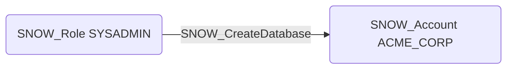

# SNOW_CreateDatabase

## Edge Schema

- Source: [SNOW_Role](../NodeDescriptions/SNOW_Role.md), [SNOW_ApplicationRole](../NodeDescriptions/SNOW_ApplicationRole.md)
- Destination: [SNOW_Account](../NodeDescriptions/SNOW_Account.md)

## General Information

The non-traversable `SNOW_CreateDatabase` edge represents that the source role has been granted the privilege to create new databases within the Snowflake account. Databases are top-level containers that organize schemas, tables, views, and other objects. While less directly dangerous than some other create privileges, new databases could be used to stage data for exfiltration, create shadow copies of sensitive data outside normal monitoring, or establish hidden storage areas for malicious operations that evade standard auditing controls.

