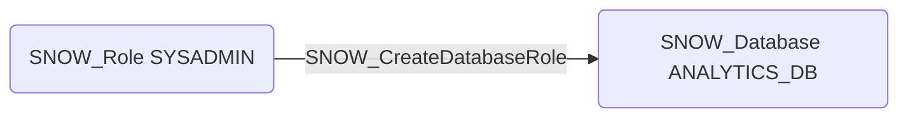

# SNOW_CreateDatabaseRole

## Edge Schema

- Source: [SNOW_Role](../NodeDescriptions/SNOW_Role.md), [SNOW_ApplicationRole](../NodeDescriptions/SNOW_ApplicationRole.md)
- Destination: [SNOW_Account](../NodeDescriptions/SNOW_Account.md), [SNOW_Database](../NodeDescriptions/SNOW_Database.md)

## General Information

The non-traversable `SNOW_CreateDatabaseRole` edge represents that the source role has been granted the privilege to create database roles within the account or a specific database. Database roles provide fine-grained access control scoped to a single database, allowing granular privilege assignment on schemas, tables, and other objects within that database. This privilege could be used to establish persistent access by creating database roles that are granted sensitive object-level privileges, potentially bypassing account-level role auditing that focuses on top-level role grants.

