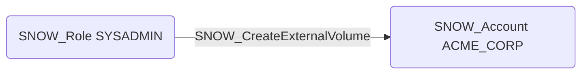

# SNOW_CreateExternalVolume

## Edge Schema

- Source: [SNOW_Role](../NodeDescriptions/SNOW_Role.md), [SNOW_ApplicationRole](../NodeDescriptions/SNOW_ApplicationRole.md)
- Destination: [SNOW_Account](../NodeDescriptions/SNOW_Account.md)

## General Information

The non-traversable `SNOW_CreateExternalVolume` edge represents that the source role has been granted the privilege to create external volumes used for Apache Iceberg tables. External volumes define connections to external cloud storage locations such as Amazon S3, Azure Blob Storage, or Google Cloud Storage where Iceberg table data is stored. This privilege could establish connections to external storage that bypasses Snowflake access controls, allowing data to be written to or read from attacker-controlled storage buckets outside the governance boundary of the Snowflake account.

