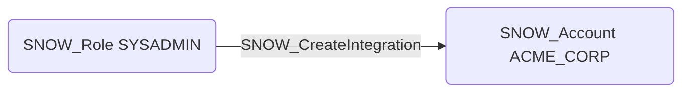

# SNOW_CreateIntegration

## Edge Schema

- Source: [SNOW_Role](../NodeDescriptions/SNOW_Role.md), [SNOW_ApplicationRole](../NodeDescriptions/SNOW_ApplicationRole.md)
- Destination: [SNOW_Account](../NodeDescriptions/SNOW_Account.md)

## General Information

The non-traversable `SNOW_CreateIntegration` edge represents that the source role has been granted the privilege to create integrations, including storage integrations, API integrations, security integrations, and notification integrations. Integrations connect Snowflake to external services and define trusted relationships with cloud providers, identity providers, and third-party systems. This privilege is a potential lateral movement vector, as an attacker could create integrations that bridge Snowflake to external infrastructure under their control, enabling data exfiltration through storage integrations or authentication bypass through malicious security integrations.

