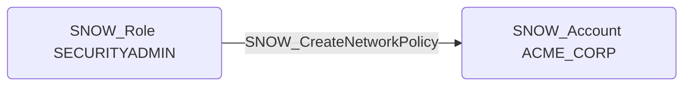

# SNOW_CreateNetworkPolicy

## Edge Schema

- Source: [SNOW_Role](../NodeDescriptions/SNOW_Role.md), [SNOW_ApplicationRole](../NodeDescriptions/SNOW_ApplicationRole.md)
- Destination: [SNOW_Account](../NodeDescriptions/SNOW_Account.md)

## General Information

The non-traversable `SNOW_CreateNetworkPolicy` edge represents that the source role has been granted the privilege to create network policies that control IP-based access to the Snowflake account. Network policies define allowed and blocked IP address ranges for incoming connections. A malicious actor could create permissive network policies to bypass existing IP restrictions, potentially opening the account to connections from unauthorized networks or removing geographic access controls that serve as a defense-in-depth layer.

