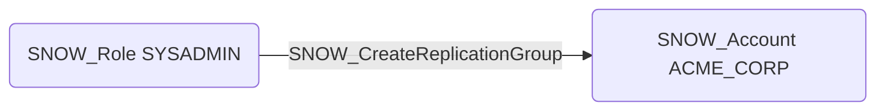

# SNOW_CreateReplicationGroup

## Edge Schema

- Source: [SNOW_Role](../NodeDescriptions/SNOW_Role.md), [SNOW_ApplicationRole](../NodeDescriptions/SNOW_ApplicationRole.md)
- Destination: [SNOW_Account](../NodeDescriptions/SNOW_Account.md)

## General Information

The non-traversable `SNOW_CreateReplicationGroup` edge represents that the source role has been granted the privilege to create replication groups for cross-account and cross-region data replication. Replication groups define sets of databases, shares, and other account objects that are replicated to target accounts. This privilege could be used to replicate sensitive data to attacker-controlled accounts in other regions or cloud providers, enabling large-scale data exfiltration that appears as legitimate replication activity in audit logs.

