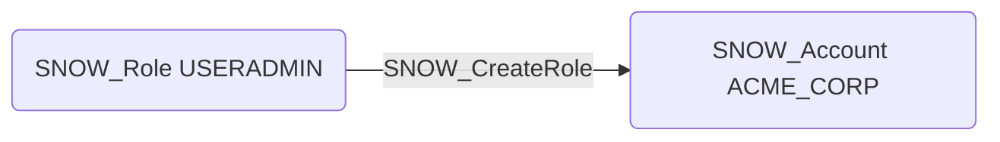

# SNOW_CreateRole

## Edge Schema

- Source: [SNOW_Role](../NodeDescriptions/SNOW_Role.md), [SNOW_ApplicationRole](../NodeDescriptions/SNOW_ApplicationRole.md)
- Destination: [SNOW_Account](../NodeDescriptions/SNOW_Account.md)

## General Information

The non-traversable `SNOW_CreateRole` edge represents that the source role has been granted the privilege to create new roles within the Snowflake account. Roles are the fundamental unit of access control in Snowflake, and the ability to create them is a key component of privilege escalation. Combined with MANAGE GRANTS, this privilege enables creation of custom roles with arbitrary privileges, allowing an attacker to construct a role hierarchy that grants access to any object in the account while potentially evading detection through deeply nested role chains.

