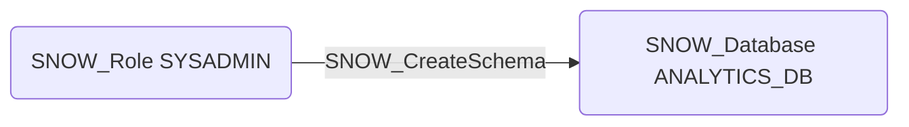

# SNOW_CreateSchema

## Edge Schema

- Source: [SNOW_Role](../NodeDescriptions/SNOW_Role.md), [SNOW_ApplicationRole](../NodeDescriptions/SNOW_ApplicationRole.md)
- Destination: [SNOW_Account](../NodeDescriptions/SNOW_Account.md), [SNOW_Database](../NodeDescriptions/SNOW_Database.md)

## General Information

The non-traversable `SNOW_CreateSchema` edge represents that the source role has been granted the privilege to create schemas within databases. Schemas organize database objects such as tables, views, stages, functions, and procedures into logical groupings. Creating new schemas could be used to stage unauthorized data operations, establish hidden namespaces for malicious stored procedures or functions, or create parallel data structures that duplicate sensitive information outside the scope of standard data governance and monitoring controls.

