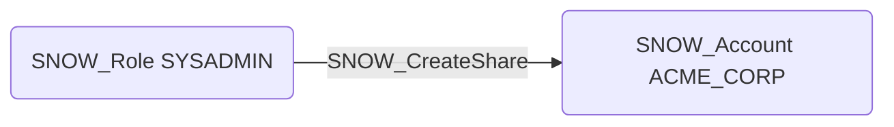

# SNOW_CreateShare

## Edge Schema

- Source: [SNOW_Role](../NodeDescriptions/SNOW_Role.md), [SNOW_ApplicationRole](../NodeDescriptions/SNOW_ApplicationRole.md)
- Destination: [SNOW_Account](../NodeDescriptions/SNOW_Account.md)

## General Information

The non-traversable `SNOW_CreateShare` edge represents that the source role has been granted the privilege to create shares for Snowflake's secure data sharing feature. Shares allow databases, schemas, and tables to be made accessible to other Snowflake accounts without copying the data. This is a significant data exfiltration vector, as an attacker could create a share that exposes sensitive data to external Snowflake accounts under their control, enabling real-time access to production data without triggering traditional data export alerts.

