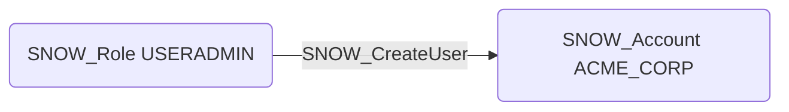

# SNOW_CreateUser

## Edge Schema

- Source: [SNOW_Role](../NodeDescriptions/SNOW_Role.md), [SNOW_ApplicationRole](../NodeDescriptions/SNOW_ApplicationRole.md)
- Destination: [SNOW_Account](../NodeDescriptions/SNOW_Account.md)

## General Information

The non-traversable `SNOW_CreateUser` edge represents that the source role has been granted the privilege to create new user accounts within the Snowflake account. This is a critical privilege for establishing persistent access. An attacker could create backdoor user accounts with known credentials, ensuring continued access even if the original compromised credentials are rotated. Combined with role grants, newly created users can be assigned powerful roles, making this privilege a key step in many privilege escalation and persistence attack paths.

