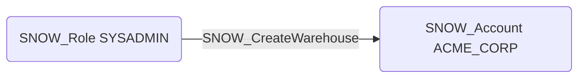

# SNOW_CreateWarehouse

## Edge Schema

- Source: [SNOW_Role](../NodeDescriptions/SNOW_Role.md), [SNOW_ApplicationRole](../NodeDescriptions/SNOW_ApplicationRole.md)
- Destination: [SNOW_Account](../NodeDescriptions/SNOW_Account.md)

## General Information

The non-traversable `SNOW_CreateWarehouse` edge represents that the source role has been granted the privilege to create virtual warehouses within the Snowflake account. Virtual warehouses provide the compute resources for executing queries and data processing operations. This privilege could incur significant compute costs by creating large warehouses with auto-resume enabled, or be used to provision dedicated compute resources for unauthorized data processing workloads such as bulk data extraction, resource-intensive cryptographic operations, or sustained queries against sensitive datasets.

