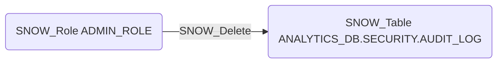

# SNOW_Delete

## Edge Schema

- Source: [SNOW_Role](../NodeDescriptions/SNOW_Role.md), [SNOW_ApplicationRole](../NodeDescriptions/SNOW_ApplicationRole.md)
- Destination: [SNOW_Table](../NodeDescriptions/SNOW_Table.md)

## General Information

The non-traversable `SNOW_Delete` edge grants the ability to delete data from the target table. DELETE access could be used for data destruction or to cover tracks by removing audit records. This is especially dangerous on tables that store security-relevant data such as access logs, audit trails, or compliance records, where selective deletion could hide evidence of unauthorized activity.

