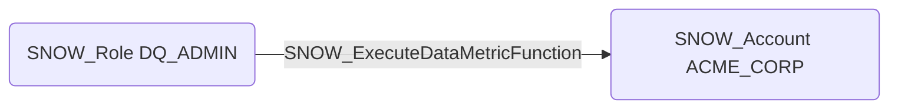

# SNOW_ExecuteDataMetricFunction

## Edge Schema

- Source: [SNOW_Role](../NodeDescriptions/SNOW_Role.md), [SNOW_ApplicationRole](../NodeDescriptions/SNOW_ApplicationRole.md)
- Destination: [SNOW_Account](../NodeDescriptions/SNOW_Account.md)

## General Information

The non-traversable `SNOW_ExecuteDataMetricFunction` edge represents the EXECUTE DATA METRIC FUNCTION privilege in Snowflake, which grants the ability to execute data metric functions for data quality monitoring across the account. While primarily intended for governance and data quality enforcement, these functions can scan table data and could be used for reconnaissance to discover sensitive data patterns or enumerate table contents. An attacker with this privilege could leverage data metric functions to systematically profile data across tables without requiring direct SELECT access.

