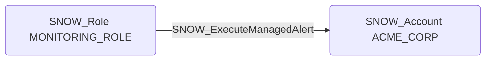

# SNOW_ExecuteManagedAlert

## Edge Schema

- Source: [SNOW_Role](../NodeDescriptions/SNOW_Role.md), [SNOW_ApplicationRole](../NodeDescriptions/SNOW_ApplicationRole.md)
- Destination: [SNOW_Account](../NodeDescriptions/SNOW_Account.md)

## General Information

The non-traversable `SNOW_ExecuteManagedAlert` edge represents the EXECUTE MANAGED ALERT privilege in Snowflake, which grants the ability to execute managed alerts within the account. Alerts trigger actions based on data conditions, which could be exploited to execute operations when specific thresholds or data states are met. An attacker with this privilege could configure alerts to perform unauthorized actions in response to carefully crafted conditions, effectively creating event-driven attack triggers that operate autonomously.

