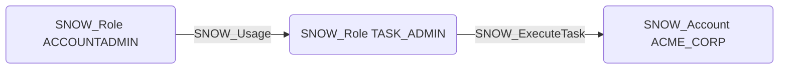

# SNOW_ExecuteTask

## Edge Schema

- Source: [SNOW_Role](../NodeDescriptions/SNOW_Role.md), [SNOW_ApplicationRole](../NodeDescriptions/SNOW_ApplicationRole.md)
- Destination: [SNOW_Account](../NodeDescriptions/SNOW_Account.md)

## General Information

The non-traversable `SNOW_ExecuteTask` edge represents the EXECUTE TASK privilege in Snowflake, which grants the ability to execute tasks (scheduled SQL operations) within the account. Tasks can run arbitrary SQL with the privileges of the task owner role, making this a potential privilege escalation vector if the task owner role has higher privileges than the executing role. An attacker with this privilege could create or modify tasks to execute malicious SQL on a schedule, leveraging the elevated privileges of the task owner for data exfiltration or lateral movement.

