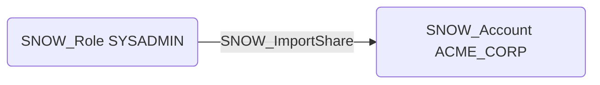

# SNOW_ImportShare

## Edge Schema

- Source: [SNOW_Role](../NodeDescriptions/SNOW_Role.md), [SNOW_ApplicationRole](../NodeDescriptions/SNOW_ApplicationRole.md)
- Destination: [SNOW_Account](../NodeDescriptions/SNOW_Account.md)

## General Information

The non-traversable `SNOW_ImportShare` edge represents the IMPORT SHARE privilege in Snowflake, which grants the ability to import data shares from other Snowflake accounts. Importing a share from an attacker-controlled account could introduce malicious data, poisoned datasets, or objects containing harmful stored procedures into the environment. An attacker with this privilege could establish a data pipeline from an external account they control, potentially introducing trojanized views or functions that execute malicious code when accessed by other users in the target account.

