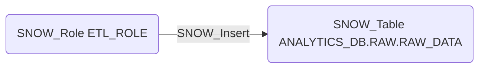

# SNOW_Insert

## Edge Schema

- Source: [SNOW_Role](../NodeDescriptions/SNOW_Role.md), [SNOW_ApplicationRole](../NodeDescriptions/SNOW_ApplicationRole.md)
- Destination: [SNOW_Table](../NodeDescriptions/SNOW_Table.md)

## General Information

The non-traversable `SNOW_Insert` edge grants the ability to insert data into the target table. INSERT access could allow data poisoning, injection of malicious records, or creation of backdoor entries in permission tables. This is particularly dangerous when combined with tables that drive application logic, user authentication, or access control decisions.

