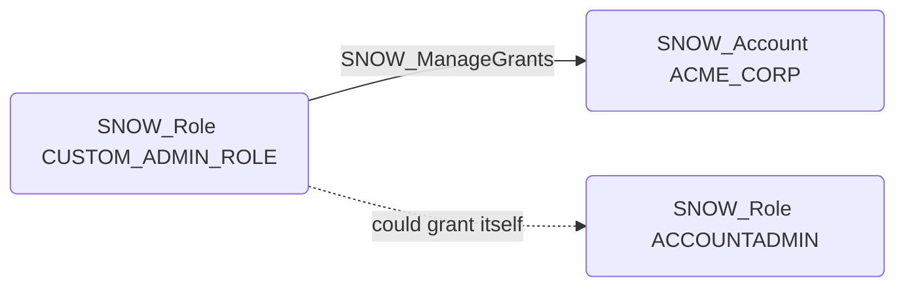

# SNOW_ManageGrants

## Edge Schema

- Source: [SNOW_Role](../NodeDescriptions/SNOW_Role.md), [SNOW_ApplicationRole](../NodeDescriptions/SNOW_ApplicationRole.md)
- Destination: [SNOW_Account](../NodeDescriptions/SNOW_Account.md)

## General Information

The non-traversable `SNOW_ManageGrants` edge grants the ability to manage privilege grants on the account, including granting and revoking any privilege to any role. This is effectively equivalent to SECURITYADMIN-level access because a role with MANAGE GRANTS can grant itself any privilege, including OWNERSHIP of any object. This edge should be treated as a critical escalation path -- any principal that can reach a role with MANAGE GRANTS can effectively gain full account control.

