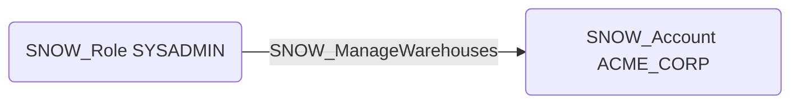

# SNOW_ManageWarehouses

## Edge Schema

- Source: [SNOW_Role](../NodeDescriptions/SNOW_Role.md), [SNOW_ApplicationRole](../NodeDescriptions/SNOW_ApplicationRole.md)
- Destination: [SNOW_Account](../NodeDescriptions/SNOW_Account.md)

## General Information

The non-traversable `SNOW_ManageWarehouses` edge grants the ability to manage all warehouses in the account. This is broader than OPERATE on individual warehouses -- it allows creating, modifying, and dropping any warehouse. An attacker with this privilege could create large warehouses to incur costs, drop production warehouses to cause outages, or modify warehouse configurations to bypass resource constraints.

