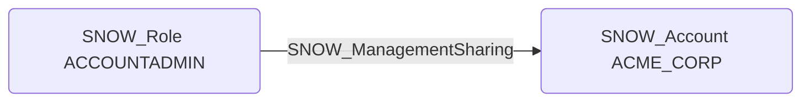

# SNOW_ManagementSharing

## Edge Schema

- Source: [SNOW_Role](../NodeDescriptions/SNOW_Role.md), [SNOW_ApplicationRole](../NodeDescriptions/SNOW_ApplicationRole.md)
- Destination: [SNOW_Account](../NodeDescriptions/SNOW_Account.md)

## General Information

The non-traversable `SNOW_ManagementSharing` edge grants the ability to manage sharing configurations on the account. This could allow an attacker to share sensitive data externally or modify existing share configurations. Data sharing is a particularly dangerous capability because it can expose data to external Snowflake accounts, potentially exfiltrating sensitive information outside organizational boundaries without leaving traditional audit trails.

