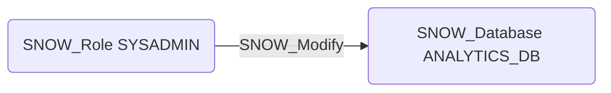

# SNOW_Modify

## Edge Schema

- Source: [SNOW_Role](../NodeDescriptions/SNOW_Role.md), [SNOW_ApplicationRole](../NodeDescriptions/SNOW_ApplicationRole.md)
- Destination: [SNOW_Database](../NodeDescriptions/SNOW_Database.md), [SNOW_Warehouse](../NodeDescriptions/SNOW_Warehouse.md), [SNOW_Schema](../NodeDescriptions/SNOW_Schema.md), [SNOW_Table](../NodeDescriptions/SNOW_Table.md), [SNOW_View](../NodeDescriptions/SNOW_View.md), [SNOW_Stage](../NodeDescriptions/SNOW_Stage.md)

## General Information

The non-traversable `SNOW_Modify` edge grants the ability to modify the target object's properties and configuration. Modify can change object settings, which may have security implications such as disabling change tracking, altering retention policies, or modifying warehouse resource limits. While not a direct data access privilege, MODIFY on critical objects can weaken security controls or enable denial of service through configuration changes.

