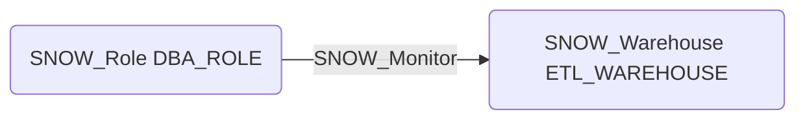

# SNOW_Monitor

## Edge Schema

- Source: [SNOW_Role](../NodeDescriptions/SNOW_Role.md), [SNOW_ApplicationRole](../NodeDescriptions/SNOW_ApplicationRole.md)
- Destination: [SNOW_Warehouse](../NodeDescriptions/SNOW_Warehouse.md), [SNOW_Account](../NodeDescriptions/SNOW_Account.md), [SNOW_Database](../NodeDescriptions/SNOW_Database.md), [SNOW_Schema](../NodeDescriptions/SNOW_Schema.md)

## General Information

The non-traversable `SNOW_Monitor` edge grants the ability to monitor the target object's status and resource usage. While primarily informational, monitoring access can reveal sensitive operational details about warehouse utilization, query patterns, and account activity. An attacker with MONITOR access could perform reconnaissance to understand workload patterns, identify high-value targets, and plan further attacks based on observed usage.

