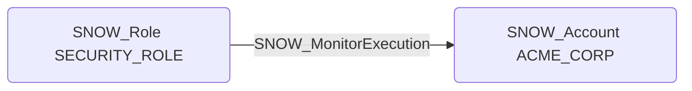

# SNOW_MonitorExecution

## Edge Schema

- Source: [SNOW_Role](../NodeDescriptions/SNOW_Role.md), [SNOW_ApplicationRole](../NodeDescriptions/SNOW_ApplicationRole.md)
- Destination: [SNOW_Account](../NodeDescriptions/SNOW_Account.md)

## General Information

The non-traversable `SNOW_MonitorExecution` edge grants the ability to monitor execution of queries and tasks across the account. This reveals active queries, their SQL text, and execution plans, which may expose sensitive business logic or data access patterns. An attacker with this privilege could observe query text containing sensitive values, identify privileged operations for replay, and map out the data access patterns of other users and roles.

