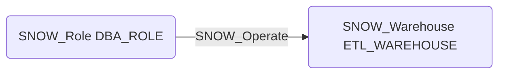

# SNOW_Operate

## Edge Schema

- Source: [SNOW_Role](../NodeDescriptions/SNOW_Role.md), [SNOW_ApplicationRole](../NodeDescriptions/SNOW_ApplicationRole.md)
- Destination: [SNOW_Warehouse](../NodeDescriptions/SNOW_Warehouse.md)

## General Information

The non-traversable `SNOW_Operate` edge grants the ability to start, stop, suspend, and resume a warehouse. An attacker with OPERATE could cause denial of service by suspending critical warehouses, or incur significant costs by resuming and scaling up warehouses. This privilege should be carefully controlled as warehouse operations directly impact both availability and cost.

