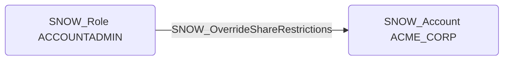

# SNOW_OverrideShareRestrictions

## Edge Schema

- Source: [SNOW_Role](../NodeDescriptions/SNOW_Role.md), [SNOW_ApplicationRole](../NodeDescriptions/SNOW_ApplicationRole.md)
- Destination: [SNOW_Account](../NodeDescriptions/SNOW_Account.md)

## General Information

The non-traversable `SNOW_OverrideShareRestrictions` edge represents the OVERRIDE SHARE RESTRICTIONS privilege in Snowflake, which grants the ability to override share restrictions that normally prevent certain operations on shared data. Overriding these restrictions could allow modification or redistribution of shared data beyond what the data provider intended, violating data sharing agreements. An attacker with this privilege could bypass controls set by the data provider, potentially re-sharing sensitive data to unauthorized accounts or performing operations on shared objects that were explicitly restricted by the originating account.

