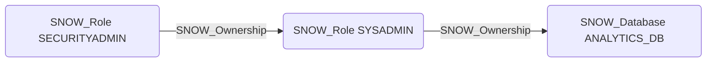

# SNOW_Ownership

## Edge Schema

- Source: [SNOW_Role](../NodeDescriptions/SNOW_Role.md), [SNOW_ApplicationRole](../NodeDescriptions/SNOW_ApplicationRole.md)
- Destination: [SNOW_Role](../NodeDescriptions/SNOW_Role.md), [SNOW_User](../NodeDescriptions/SNOW_User.md), [SNOW_Database](../NodeDescriptions/SNOW_Database.md), [SNOW_Warehouse](../NodeDescriptions/SNOW_Warehouse.md), [SNOW_Integration](../NodeDescriptions/SNOW_Integration.md), [SNOW_Application](../NodeDescriptions/SNOW_Application.md), [SNOW_Schema](../NodeDescriptions/SNOW_Schema.md), [SNOW_Table](../NodeDescriptions/SNOW_Table.md), [SNOW_View](../NodeDescriptions/SNOW_View.md), [SNOW_Stage](../NodeDescriptions/SNOW_Stage.md), [SNOW_Function](../NodeDescriptions/SNOW_Function.md), [SNOW_Procedure](../NodeDescriptions/SNOW_Procedure.md)

## General Information

The non-traversable `SNOW_Ownership` edge indicates the source role owns the target object, granting full administrative control. Ownership is the highest-level privilege on any Snowflake object -- an owner can grant any privilege on the object to other roles, modify the object, and transfer ownership. This edge is critical for attack path analysis as ownership chains can lead to privilege escalation, particularly when a role owns other roles or security-sensitive objects.

