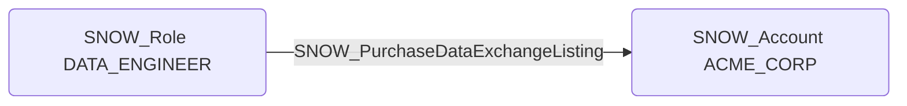

# SNOW_PurchaseDataExchangeListing

## Edge Schema

- Source: [SNOW_Role](../NodeDescriptions/SNOW_Role.md), [SNOW_ApplicationRole](../NodeDescriptions/SNOW_ApplicationRole.md)
- Destination: [SNOW_Account](../NodeDescriptions/SNOW_Account.md)

## General Information

The non-traversable `SNOW_PurchaseDataExchangeListing` edge represents the PURCHASE DATA EXCHANGE LISTING privilege in Snowflake, which grants the ability to purchase data exchange listings from the Snowflake Marketplace. This could incur unexpected costs by purchasing expensive data products, or bring untrusted external data into the environment that has not been vetted by security or data governance teams. An attacker with this privilege could acquire data listings that introduce malicious or misleading data into the organization's analytics pipelines, or generate significant financial charges through unauthorized marketplace purchases.

