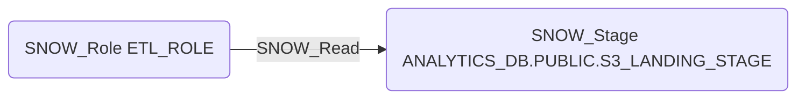

# SNOW_Read

## Edge Schema

- Source: [SNOW_Role](../NodeDescriptions/SNOW_Role.md), [SNOW_ApplicationRole](../NodeDescriptions/SNOW_ApplicationRole.md)
- Destination: [SNOW_Stage](../NodeDescriptions/SNOW_Stage.md)

## General Information

The non-traversable `SNOW_Read` edge grants the ability to read data files from the target stage. Stages may contain sensitive data files, exported datasets, or credentials used for external integrations. An attacker with READ access to a stage could exfiltrate staged data files, access exported reports containing sensitive information, or discover credentials and configuration files stored in internal or external stages.

