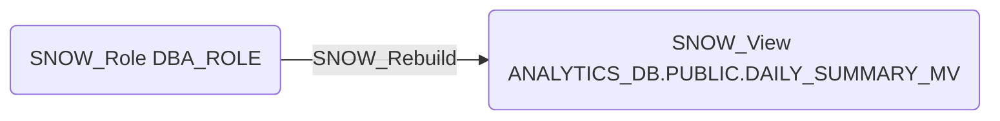

# SNOW_Rebuild

## Edge Schema

- Source: [SNOW_Role](../NodeDescriptions/SNOW_Role.md), [SNOW_ApplicationRole](../NodeDescriptions/SNOW_ApplicationRole.md)
- Destination: [SNOW_Table](../NodeDescriptions/SNOW_Table.md), [SNOW_View](../NodeDescriptions/SNOW_View.md)

## General Information

The non-traversable `SNOW_Rebuild` edge grants the ability to rebuild the target object. Rebuilding can cause temporary unavailability and trigger recomputation of materialized views. While not a direct data access privilege, an attacker with REBUILD access could cause denial of service by triggering expensive rebuild operations on large materialized views, consuming warehouse resources and blocking other queries.

